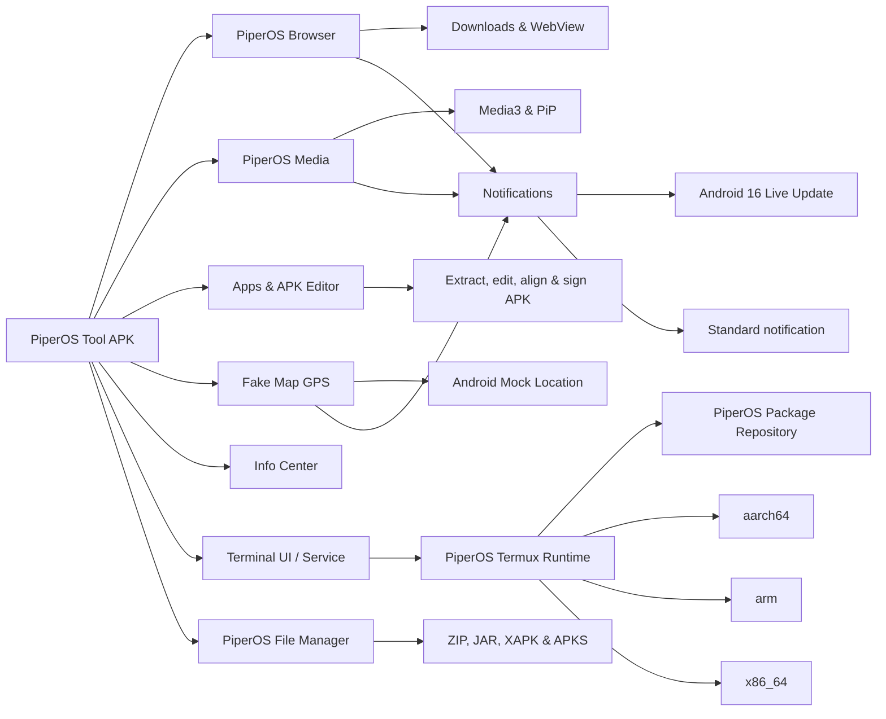

<p align="center">
  
</p>

<h1 align="center">PiperOS Tool</h1>

<p align="center">
  Bộ công cụ Android thử nghiệm gồm APK Editor, quản lý tệp, trình duyệt, media, thiết bị và terminal cục bộ.
</p>

<p align="center">
  <a href="https://github.com/Phi574/PiperOSTool-Android/actions/workflows/android-ci.yml"></a>
  <a href="https://github.com/Phi574/PiperOSTool-Android/blob/master/LICENSE"></a>
  
  
</p>

> PiperOS Tool đang ở giai đoạn beta. Một số tính năng cần quyền hệ thống
> nhạy cảm và có thể không hoạt động trên mọi ROM Android.

## Bản hiện tại

`3.1.1.beta` sử dụng `minSdk 24`, `targetSdk 36`, Kotlin `2.4.10` và tập trung vào:

- **PiperOS Privileged Service (PPS):** tiến trình service riêng giao tiếp qua
  AIDL/Binder, xác thực UID phía server, tự kết nối lại khi Binder chết và dùng
  một phiên `su` duy trì cho backend ROOT. File Manager có mục **Truy cập chuyên
  sâu** để xem trạng thái thật, capability, UID/PID, SELinux, uptime, log chẩn
  đoán và bật riêng quyền đọc `Android/data`, `Android/obb`, thư mục hệ điều
  hành hoặc tệp ẩn. Ghi vào vùng hệ thống luôn tắt mặc định và cần xác nhận rõ.

  MVP hiện hỗ trợ backend thường và ROOT cho duyệt/stat/đọc cùng các thao tác
  tệp cơ bản. Chế độ ADB/SHELL và Shizuku được hiển thị là chưa khả dụng thay vì
  giả báo đã kết nối; chúng được dành cho pha PPS tiếp theo.

- **Giao diện thích ứng:** giao diện Modern tối giản là mặc định, giao diện Classic
  giữ nguyên trải nghiệm cũ. Người dùng có thể chọn sáng, tối hoặc theo hệ thống và
  chuyển toàn bộ ứng dụng giữa tiếng Việt và tiếng Anh trong Settings.

- **PiperOS APK Editor:** mở APK đã cài hoặc tệp APK, duyệt cấu trúc archive,
  trích xuất theo nhóm/toàn bộ, chỉnh tệp văn bản, xem báo cáo manifest và
  xây dựng APK mới được ký bằng khóa PiperOS Editor. Có thể chọn nhiều tệp
  hoặc nguyên thư mục để backup tới vị trí tùy chọn. Backup lớn dùng tối đa
  bốn luồng, chạy bằng foreground service khi tắt màn hình/rời ứng dụng và
  báo tiến độ qua notification. Danh sách có thumbnail ảnh/video; gallery hỗ
  trợ vuốt ngang qua media cùng thư mục. Trình xem vẫn hỗ trợ GIF, âm thanh,
  PDF cùng các tệp văn bản.
- **PiperOS File Manager:** thumbnail ảnh/video/APK và app data, gallery vuốt
  ngang, icon thư mục theo ngữ nghĩa; nén/giải nén ZIP, 7Z, TAR, GZIP, BZIP2,
  XZ, LZ4 và ZSTD. ZIP hỗ trợ mật khẩu AES-256. Tác vụ archive chạy bằng
  foreground service với WakeLock và notification tiến độ.

> APK được xây dựng lại dùng khóa **PiperOS Editor test key**. Khóa này chỉ
> dành cho thử nghiệm, không dùng để phát hành; APK đầu ra không thể cập nhật
> đè lên ứng dụng gốc nếu chữ ký của ứng dụng gốc khác.

- **PiperOS Browser:** nhiều tab, tab ẩn danh, khôi phục phiên, lịch sử theo
  ngày, User-Agent tùy chỉnh, nhập phần mở rộng, tải file và phát video. Thanh
  điều hướng tự thu gọn theo cuộn trang, có trình chuyển tab trực quan, báo cáo
  quyền riêng tư và nút thoát PiperOS trong toolbar dưới.
- **Kho tài khoản Browser:** nhận diện biểu mẫu đăng nhập và chỉ lưu khi người
  dùng đồng ý. Tên đăng nhập, mật khẩu và metadata website được mã hóa cục bộ
  trước khi đồng bộ vào Firestore theo UID của tài khoản PiperOS. Màn hình quản
  lý cho phép mở khóa bằng PIN, xem, sửa và xóa từng mục; PIN không được gửi
  nguyên bản lên Firebase.
- **PiperOS Media:** quét nhạc/video trên thiết bị, lọc theo nguồn, tìm kiếm,
  sắp xếp, hàng đợi riêng, phát nền, Picture-in-Picture và điều khiển media.
- **PiperOS Terminal:** shell Android và Linux nhiều phiên, lịch sử lệnh,
  foreground service và bàn phím terminal riêng. Trình chọn runtime đọc các
  bản phát hành đã ký từ GitHub, hỗ trợ nâng cấp hoặc hạ cấp theo chế độ giữ
  dữ liệu/cài sạch. Runtime mặc định hiện tại là `2.5.6-beta`.
- **PiperOS Fake Map GPS:** mô phỏng vị trí cố định hoặc hành trình có tốc độ,
  phương tiện, dừng đỗ và lặp tuyến qua ứng dụng vị trí mô phỏng của Android.
  Hành trình hỗ trợ nhiều waypoint, tuyến gợi ý và marker GPS chuyển động trực tiếp.
- **Apps & Device:** xem ứng dụng, sao lưu APK, thông tin thiết bị và các công
  cụ quản lý quyền.
- **Android 16:** hỗ trợ thông báo tiến trình Live Update khi hệ thống cho
  phép; Android cũ tự động dùng thông báo tiêu chuẩn.

## Hai repo, một dự án

| Thành phần | Repository | Vai trò |
| --- | --- | --- |
| Android app | **PiperOSTool-Android** | Giao diện, Browser, Media, Device tools và terminal service |
| Linux runtime | [Piperos_termux](https://github.com/Phi574/Piperos_termux) | Bootstrap, package build và runtime `$PREFIX` cho ba ABI |



Runtime Termux đầy đủ chưa được đóng vào APK hiện tại. Tiến độ build bootstrap
và package repository được theo dõi tại
[Phi574/Piperos_termux](https://github.com/Phi574/Piperos_termux).

Kho package APT riêng của PiperOS được build cùng source runtime và phát hành
tại `https://raw.githubusercontent.com/Phi574/Piperos_termux/gh-pages`. Ứng dụng chỉ kích hoạt kho sau
khi xác minh runtime manifest và khóa ký repository; package Termux chính thức
không được trộn vào `$PREFIX` của PiperOS.

## Build

Yêu cầu:

- Android Studio có JDK 17 trở lên.
- Android SDK 36.
- Kết nối mạng để Gradle tải dependency.

```powershell
.\gradlew.bat assembleDebug lintDebug testDebugUnitTest
```

APK debug được tạo tại:

```text
app/build/outputs/apk/debug/app-debug.apk
```

`app/google-services.json` không nằm trong Git. Muốn bật đăng nhập và đồng bộ
Firebase, tạo Firebase project riêng, tải file cấu hình Android rồi đặt tại:

```text
app/google-services.json
```

Gradle chỉ áp dụng Google Services plugin khi file này tồn tại. Vì vậy CI và
fork công khai vẫn build được mà không làm lộ cấu hình Firebase; build không có
file sẽ tắt phần tích hợp Firebase. Không commit file này hoặc service-account
JSON lên repository.

Rules mẫu cho Realtime Database và Cloud Firestore nằm trong
`database.rules.json` và `firestore.rules`. Sau khi kiểm tra đúng project, triển
khai bằng Firebase CLI:

```powershell
firebase deploy --only database,firestore:rules
```

Firestore Rules chỉ cho UID đang xác thực truy cập kho tài khoản của chính UID
đó; các đường dẫn không khớp tiếp tục bị từ chối mặc định.

## Quyền và dữ liệu

Ứng dụng có các tính năng cần đọc media, danh sách ứng dụng, thông báo, usage
access hoặc quyền quản lý tệp. PiperOS chỉ nên yêu cầu quyền khi tính năng liên
quan được người dùng chủ động mở. Xem [PRIVACY.md](PRIVACY.md) để biết phạm vi
dữ liệu và [SECURITY.md](SECURITY.md) để báo cáo lỗ hổng.

## Đóng góp

Đọc [CONTRIBUTING.md](CONTRIBUTING.md), mở issue bằng mẫu có sẵn và chạy đầy
đủ build/lint trước khi gửi pull request.

## Giấy phép

PiperOS Tool được phát hành theo **GNU GPL version 3 only**. Xem
[LICENSE](LICENSE), [COPYRIGHT](COPYRIGHT) và
[THIRD_PARTY_NOTICES.md](THIRD_PARTY_NOTICES.md).
