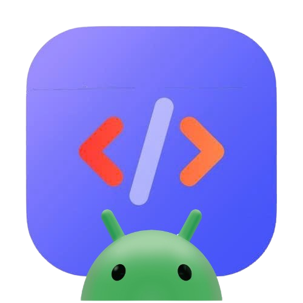
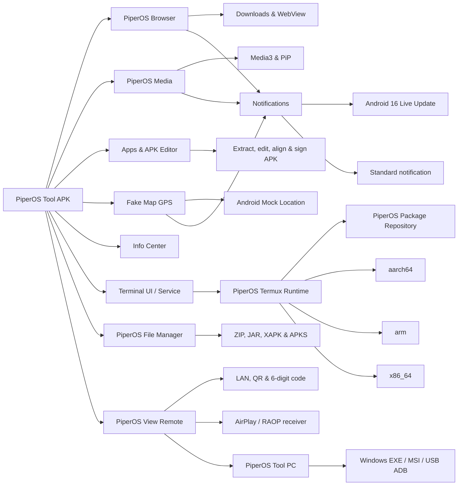

<p align="center">
  
</p>

<h1 align="center">PiperOS Tool</h1>

<p align="center">
  Bộ công cụ Android thử nghiệm gồm APK Editor, quản lý tệp, trình duyệt, media, thiết bị và terminal cục bộ.
</p>

<p align="center">
  <a href="https://github.com/Phi574/PiperOSTool-Android/actions/workflows/android-ci.yml"></a>
  <a href="https://github.com/Phi574/PiperOSTool-Android/blob/master/LICENSE"></a>
  
  
</p>

> PiperOS Tool đang ở giai đoạn beta. Một số tính năng cần quyền hệ thống
> nhạy cảm và có thể không hoạt động trên mọi ROM Android.

## Giấy phép và bản quyền

Mã nguồn do dự án phát triển được cấp phép theo **GNU GPL-3.0-only**; xem
[`LICENSE`](LICENSE) và [`COPYRIGHT`](COPYRIGHT). Các thành phần bên thứ ba
giữ giấy phép riêng của chúng, được liệt kê trong
[`THIRD_PARTY_NOTICES.md`](THIRD_PARTY_NOTICES.md). MIT áp dụng cho thành phần
LiquidGlass từng có trong các bản cũ, không phải giấy phép thứ hai cho toàn bộ
PiperOS Tool.

## Bản hiện tại

`3.6.9.PRE` (versionCode `72`) sử dụng `minSdk 29 (Android 10)`, `targetSdk 37 (Android 17)`, Kotlin `2.4.10`.

**Tải và cài đặt:** [Bản phát hành 3.6.9.PRE](https://github.com/Phi574/PiperOSTool-Android/releases/tag/v3.6.9.PRE). APK được ký bằng cùng khóa như các bản trước; màn Cập nhật chỉ chấp nhận APK có cùng chữ ký với bản đang cài.

### Cải tiến trong 3.6.9.PRE

- Thu nhỏ ảnh tiến trình tải/xác minh APK trong màn hình Cập nhật để phần log gọn hơn.
- Chừa vùng an toàn dưới thanh trạng thái ở trang chủ và bảng tài khoản; thu nhỏ icon trong bảng `window`, giữ nguyên màu gốc icon các tính năng trên trang chủ.

### Cải tiến trong 3.6.8.PRE

- Cập nhật ứng dụng cho Android 17 (API 37).
- Làm gọn trang chủ và chuyển PiperOS QR từ Beta sang Trang chủ.
- Thêm bảng tài khoản trượt từ cạnh phải, gom hồ sơ, bảo mật, hỗ trợ và đăng xuất; ẩn thanh menu dưới khi bảng mở.
- Chuyển thiết bị đăng nhập vào Mật khẩu bảo mật; Đổi mật khẩu và Quản lý liên kết được đánh dấu BETA và tạm khóa.
- Bỏ mục hồ sơ và đăng xuất khỏi trang Thông tin/Cài đặt.

### Cải tiến trong 3.6.7.PRE

- Màn Cập nhật hiển thị ảnh tiến trình tải theo phần trăm và ảnh kết quả sau khi xác minh chữ ký, tên gói và phiên bản APK.

### Cải tiến trong 3.6.6.PRE

- Bổ sung bảng chẩn đoán Receiver AirPlay, gồm đăng ký dịch vụ, kết nối iPhone/iPad, luồng video và tốc độ nhận dữ liệu; kết quả tốt và lỗi có màu riêng.
- Căn giữa bảng kiểm tra khởi động theo chiều dọc và đặt log trong thẻ dễ đọc.
- Tự mở lại xác thực vân tay khi quay về app sau khi khóa màn hình hoặc chuyển sang ứng dụng khác.

### Cải tiến trong 3.6.5.PRE

- PiperOS ADB giữ kết nối dùng chung sau khi rời Activity nếu công tắc đã được bật; khi người dùng tắt, dịch vụ vẫn dừng hoàn toàn.
- Lỗi package bị Android/ColorOS bảo vệ hiển thị hướng dẫn thay vì Java stack trace.

### Cải tiến trong 3.6.4.PRE

- PiperOS Runtime báo lỗi khởi động dịch vụ thay vì để giao diện mắc ở “Đang chuẩn bị”; thao tác hủy đóng kết nối tải đang hoạt động.
- PiperOS Media đồng bộ bộ lọc với bảng màu sáng/tối.
- Trang Ứng dụng có công tắc ép mở Activity riêng tư bằng PiperOS ADB và nút dừng/gỡ ứng dụng với xác nhận.

### Cải tiến trong 3.6.3.PRE

- Màn hình khởi động tuần tự kiểm tra Internet, GitHub, Firebase Auth và bản cập nhật; khi offline có thể tiếp tục hoặc thử lại, và khi có bản mới có thể cập nhật hoặc bỏ qua.
- Chuyển các liên kết dự án mã nguồn mở sang trang Thông tin; bổ sung PiperOS Tool PC, Module PiperOS Tool và thông tin liên hệ có thể bấm để mở.

### Sửa lỗi trong 3.5.10.PRE

- Tích hợp Firebase App Check với Play Integrity để app gửi token hợp lệ khi gọi Firebase; enforcement chỉ bật lại sau khi kiểm tra request metrics.

### Sửa lỗi trong 3.5.9.PRE

- Giữ màn xác minh số điện thoại trong luồng xác thực thay vì để bộ kiểm tra phiên chuyển người dùng ngược về Login.

### Cải tiến trong 3.5.8.PRE

- Thêm đăng nhập Google bằng Credential Manager và Firebase Authentication; đăng nhập email yêu cầu xác minh địa chỉ trước khi vào ứng dụng.
- Thêm đăng nhập/đăng ký bằng số điện thoại, gửi và xác minh mã SMS trong Activity riêng.
- Gửi email xác minh sau đăng ký, cho gửi lại email xác minh và dùng luồng đặt lại mật khẩu hiện hành của Firebase.
- Thay cấu hình Firebase Android bằng tệp cấu hình mới (không lưu tệp cấu hình chứa thông tin dự án trong Git).
- Nâng versionCode lên 59 để cập nhật từ 3.5.7.PRE.

**Cấu hình Firebase cần bật:** bật Google và Phone trong Authentication > Sign-in method; với Phone, thiết lập SMS region policy. Thêm SHA-1 và SHA-256 của chứng thư ký ứng dụng vào Firebase Project Settings rồi tải lại `google-services.json`. Google sign-in cần Web client ID do tệp cấu hình tạo ra.

### Cải tiến trong 3.5.7.PRE

- Thẻ PiperOS QR trong Beta mở Activity hai tab Tạo và Quét, không còn khóa PREVIEW.
- Hỗ trợ tạo 17 loại payload QR, lưu/chia sẻ ảnh và xử lý nội dung quét bằng ứng dụng phù hợp sau khi người dùng xác nhận.
- Bộ chọn loại QR dùng menu PiperOS; màn hình quét khóa dọc và tiêu đề chừa vùng thanh trạng thái.
- Sửa nhãn nổi của các trường nhập để theo đúng font Inter hoặc font tích hợp mà người dùng đã chọn.

### Cải tiến trong 3.5.6.PRE

- Chuyển PiperOS Fake Map GPS sang Trang chủ và gỡ thẻ khỏi Beta.
- Thêm thẻ PiperOS QR vào Beta theo bố cục các tính năng khác, với nhãn PREVIEW màu đỏ và trạng thái chưa phát hành.

### Cải tiến trong 3.5.5.PRE

- Chỉ giữ lựa chọn phông chữ tích hợp sẵn; bỏ thao tác thêm font thủ công.
- Hình nền tùy chỉnh áp dụng cho cả năm tab chính; các thẻ nền được làm trong nhẹ để vẫn đọc rõ nội dung.
- Sửa hiển thị cửa sổ chọn kiểu khóa và dùng hộp thoại PiperOS khi yêu cầu khởi động lại để đổi nền.
- Báo trước FCM PiperOS trên Home; thêm thẻ Beta chưa phát hành, không tương tác.

### Giao diện trong 3.5.4.PRE

- Cập nhật bố cục, icon và màu giao diện theo tinh chỉnh mới.

### Giao diện Hiện Đại trong 3.5.3.PRE

- Gỡ module LiquidGlass và lựa chọn Kiểu giao diện; giữ tùy chọn màu Theo hệ thống, Sáng, Tối.
- Hai thẻ Trang chủ, nút màn Cập nhật và các hộp thoại dùng thẻ Hiện Đại bo góc.

### Sửa luồng cài trên OnePlus trong 3.5.2.PRE

- Tệp tải và URI chuyển cho trình cài đặt nay có tên riêng theo phiên bản và SHA-256, tránh dùng lại `piperos-update.apk` cho mọi bản.
- Màn Cập nhật hiển thị rõ phiên bản APK đã xác thực trước khi mở trình cài đặt.

### Cải tiến mới trong 3.5.1.PRE

- Menu tab dưới cùng chuyển sang kiểu Hiện Đại bo góc; tab được chọn đậm màu, không còn kính và hiệu ứng trượt.
- Xóa thông báo dự án trên Trang chủ, đổi nền Sáng thành trắng/xám nhẹ và nền Tối thành xanh đậm/xanh nhạt.
- Bo góc thẻ, nút và ô nhập trong giao diện Hiện Đại.

### Cải tiến mới trong 3.4.5.PRE

- Trong Cài đặt có màn Cập nhật đọc GitHub Releases, hiển thị mô tả phiên bản và trạng thái bản mới nhất.
- Có xác nhận trước khi tải, tiến độ, log tải mở rộng và hủy; APK được xác thực chữ ký, tên gói và phiên bản trước khi mở trình cài đặt.

### Cải tiến mới trong 3.4.3

- Terminal tự ngừng dịch vụ nền khi đóng ứng dụng và chỉ còn shell rảnh; lệnh đang chạy vẫn được giữ. Fake Map giảm cập nhật và nhả wake lock khi tạm dừng.
- PiperOS Browser xuất hiện ở Home thay cho Beta.

### Cải tiến mới trong 3.4.2

- Sửa dịch vụ Truy cập chuyên sâu bị crash ở tiến trình PPS; chặn kết quả khởi động cũ ghi đè trạng thái Dừng và giới hạn thời gian chờ Binder.
- Trình quản lý tệp báo rõ lỗi quyền, nhận diện đúng vùng Android/data, Android/obb và tệp hệ thống; tạo thư mục, đổi tên, xóa trong vùng chuyên sâu qua PPS.
- Gỡ Trung tâm VPN và Quản lý tài khoản của Browser, bao gồm màn hình và luồng lưu mật khẩu.
- Phiên User-Agent có Activity riêng với 1.307 mục từ `dataPhone.xlsx`, lọc hãng/dòng/máy, mã máy, phiên bản OS và token trình duyệt; cấu hình được áp dụng sau khi khởi động lại Browser, giữ tab/cookie.
- Chọn vị trí website trên bản đồ riêng của Browser; trang web nhận tọa độ HTML5 đã chọn mà không đổi GPS hệ thống hay IP công cộng. Bộ chọn thiết bị dùng hộp kính có danh sách cuộn độc lập và ô tìm kiếm.

### Cải tiến mới trong 3.4.1

- Thu nhỏ icon vị trí trên Fake Map GPS, giữ bản đồ dễ nhìn.
- Nền cửa sổ sẵn từ khung hình đầu, giảm chớp viền trắng và tải giao diện muộn; thêm chuyển cảnh ngắn khi mở/đóng trang.
- Đồng nhất thanh công cụ của View Remote, Chiếu màn hình Apple và Trình quản lý tệp với Fake Map GPS.
- PiperOS Browser luôn hiện trong Beta, kể cả khi offline, không hiện thông báo bị ẩn.
- Màn hình khởi động dùng lối vào ngoại tuyến có giới hạn thời gian khi Firebase không phản hồi.
- Xóa trang vô hiệu hóa tài khoản và luồng điều hướng liên quan; vẫn giữ kiểm tra phiên đăng nhập và phiên thiết bị bị thu hồi.

### Cải tiến mới trong 3.4.0.beta

- LiquidGlass cho thanh công cụ, bảng điều khiển và danh sách của Media, Terminal, Fake GPS, File Manager, View Remote và Apple Mirroring.
- Dialog và menu nổi dùng LiquidGlass trong giao diện Classic; giao diện Modern vẫn dùng kiểu riêng.
- Thu gọn panel, thanh chọn tệp và icon; điều chỉnh vùng media và bàn phím Terminal khi xoay ngang.

### Cải tiến trước trong 3.3.6.Beta

- LiquidGlass cho Home, Beta, Ứng dụng, Cài đặt, Info, màn xác thực, Thông tin người dùng và Thiết bị đăng nhập; đồng bộ ảnh nền và kích thước icon quay về.
- Hiệu ứng chuyển tab và mở/đóng mục Info; các mục thông tin không tự mở sẵn.
- Sửa vòng lặp chuyển Đăng ký/Quên mật khẩu về Login do bộ kiểm tra phiên dùng chung.
- Thêm xóa lịch sử từng phiên đã ngắt, có xác nhận và kiểm tra trạng thái trên Firestore. Giữ bản ghi thu hồi để thiết bị cũ không tự khôi phục phiên.
- Ba hộp thoại ngắt thiết bị, đổi mật khẩu và xóa lịch sử dùng nền kính native, nút kính và vùng cuộn cho nội dung dài.
- Rules Firestore hỗ trợ `historyHidden` cho phiên đã kết thúc; cần triển khai `firestore.rules` khi tự vận hành Firebase.

### Các tính năng chính

- **PiperOS View Remote:** ba pipeline truyền hình ảnh thật gồm JPEG tương thích,
  MediaCodec H.264 phần cứng và MediaCodec HEVC phần cứng. Piper Remote 4 tự thương
  lượng codec, tự hạ cấp khi thiết bị không hỗ trợ và dùng decoder phần cứng ở máy nhận.
  Chia sẻ màn hình Android trong mạng LAN, kết nối bằng
  quét QR, mã 6 chữ số, QR PC hoặc tìm thiết bị trong cùng mạng. Khi chọn QR, người
  dùng có thể tạo mã cho thiết bị khác hoặc quét QR hiển thị trên PiperOS Tool PC.
  Luồng quét QR PC xác thực một lần theo mã phiên, sau đó cho phép chia sẻ màn hình
  ngay sau khi người dùng chấp thuận MediaProjection. Thiết bị khác vẫn phải xác nhận
  yêu cầu kết nối trên màn hình PiperOS. Bên xem có thể chọn chất lượng/FPS và điều
  khiển qua Accessibility Service đã được cấp phép. Thanh trạng thái PC đo độ phân
  giải frame đang render, FPS render thực, Mbps nhận thực và độ trễ từng frame; không
  hiển thị lại thông số yêu cầu như thể đó là kết quả thực tế.
- **Chiếu màn hình Apple:** receiver AirPlay/RAOP cho iPhone, iPad và macOS.
  Dịch vụ công bố `PiperOS View Remote` trên Wi-Fi bằng mDNS, phát video và âm
  thanh độ trễ thấp, hỗ trợ cả màn hình dọc và ngang. Mã nguồn và ghi chú giấy
  phép của receiver được lưu tại `third_party/airplay_receiver/`.
- Trang Info bổ sung mục thông tin View Remote và thông tin tài khoản/thiết bị
  đang đăng nhập phục vụ kiểm tra phiên đăng nhập.

- Browser theme sáng/tối/theo hệ thống, nhiều công cụ tìm kiếm và quản lý Cookie/Token theo website.
- PiperOS Browser có **Công cụ nhà phát triển** kiểu F12: đọc DOM/HTML của tab hiện tại,
  liệt kê resource/network đã tải, xem thông tin trang và chạy JavaScript trên trang.
  Có thể áp dụng chỉnh sửa HTML vào tab hiện tại để kiểm thử nhanh; thay đổi sẽ mất khi tải lại.
- Giao diện **Liquid Glass (Cổ điển)** được xây dựng lại ở tầng theme dùng chung:
  nền màu có chiều sâu, panel kính bán trong suốt, viền phản sáng, nút capsule,
  input và thanh điều hướng kính; tự đổi tương phản cho chế độ sáng/tối và vẫn giữ
  ảnh nền tùy chỉnh của người dùng.
- Bề mặt Classic dùng module LiquidGlass View/XML được tích hợp trong repo:
  kính lấy backdrop động, SDF refraction, chromatic dispersion, highlight theo cảm biến
  và progressive blur ở mép menu cuộn. Android 13+ dùng AGSL lens pipeline; Android 10-12
  tự dùng native fallback. Bản hiện tại ưu tiên chất lượng live đầy đủ; hồ sơ tối ưu máy yếu
  sẽ được tách riêng ở bước tiếp theo.
- APK Editor giảm tải bộ nhớ khi giải nén, tách luồng chỉnh tài nguyên và smali, đồng thời báo tiến trình trung thực.
- Kiểm tra phiên Firebase và phiên thiết bị bị thu hồi.
- Fake Map GPS phát đồng thời qua Android GPS/Network và Google Fused Location, kèm tốc độ, hướng và timestamp ổn định cho ứng dụng giao thông.
- Tách phiên, cài đặt, lịch sử, terminal, media, mock GPS và workspace APK theo Firebase UID; dữ liệu cục bộ nhạy cảm được mã hóa AES-256-GCM bằng khóa Android Keystore riêng cho từng tài khoản.
- PiperOS Browser dùng WebView profile riêng theo UID để cookie, token, WebStorage và phiên đăng nhập của tài khoản A không xuất hiện trong tài khoản B.

- **PiperOS Privileged Service (PPS):** tiến trình service riêng giao tiếp qua
  AIDL/Binder, xác thực UID phía server, tự kết nối lại khi Binder chết và dùng
  một phiên `su` duy trì cho backend ROOT. File Manager có mục **Truy cập chuyên
  sâu** để xem trạng thái thật, capability, UID/PID, SELinux, uptime, log chẩn
  đoán và bật riêng quyền đọc `Android/data`, `Android/obb`, thư mục hệ điều
  hành hoặc tệp ẩn. Ghi vào vùng hệ thống luôn tắt mặc định và cần xác nhận rõ.

  MVP hiện hỗ trợ backend thường và ROOT cho duyệt/stat/đọc cùng các thao tác
  tệp cơ bản. Chế độ ADB/SHELL và Shizuku được hiển thị là chưa khả dụng thay vì
  giả báo đã kết nối; chúng được dành cho pha PPS tiếp theo.

- **Giao diện thích ứng:** giao diện Modern tối giản là mặc định, giao diện Classic
  giữ nguyên trải nghiệm cũ. Người dùng có thể chọn sáng, tối hoặc theo hệ thống và
  chuyển toàn bộ ứng dụng giữa tiếng Việt và tiếng Anh trong Settings.

- **PiperOS APK Editor:** mở APK đã cài hoặc tệp APK, duyệt cấu trúc archive,
  trích xuất theo nhóm/toàn bộ, chỉnh tệp văn bản, xem báo cáo manifest và
  xây dựng APK mới được ký bằng khóa PiperOS Editor. Có thể chọn nhiều tệp
  hoặc nguyên thư mục để backup tới vị trí tùy chọn. Backup lớn dùng tối đa
  bốn luồng, chạy bằng foreground service khi tắt màn hình/rời ứng dụng và
  báo tiến độ qua notification. Danh sách có thumbnail ảnh/video; gallery hỗ
  trợ vuốt ngang qua media cùng thư mục. Trình xem vẫn hỗ trợ GIF, âm thanh,
  PDF cùng các tệp văn bản.
- **PiperOS File Manager:** thumbnail ảnh/video/APK và app data, gallery vuốt
  ngang, icon thư mục theo ngữ nghĩa; nén/giải nén ZIP, 7Z, TAR, GZIP, BZIP2,
  XZ, LZ4 và ZSTD. ZIP hỗ trợ mật khẩu AES-256. Tác vụ archive chạy bằng
  foreground service với WakeLock và notification tiến độ.

> APK được xây dựng lại dùng khóa **PiperOS Editor test key**. Khóa này chỉ
> dành cho thử nghiệm, không dùng để phát hành; APK đầu ra không thể cập nhật
> đè lên ứng dụng gốc nếu chữ ký của ứng dụng gốc khác.

- **PiperOS Browser:** nhiều tab, tab ẩn danh, khôi phục phiên, lịch sử theo
  ngày, User-Agent tùy chỉnh, nhập phần mở rộng, tải file và phát video. Thanh
  điều hướng tự thu gọn theo cuộn trang, có trình chuyển tab trực quan, báo cáo
  quyền riêng tư và nút thoát PiperOS trong toolbar dưới.
- **Kho tài khoản Browser:** nhận diện biểu mẫu đăng nhập và chỉ lưu khi người
  dùng đồng ý. Tên đăng nhập, mật khẩu và metadata website được mã hóa cục bộ
  trước khi đồng bộ vào Firestore theo UID của tài khoản PiperOS. Màn hình quản
  lý cho phép mở khóa bằng PIN, xem, sửa và xóa từng mục; PIN không được gửi
  nguyên bản lên Firebase.
- **PiperOS Media:** quét nhạc/video trên thiết bị, lọc theo nguồn, tìm kiếm,
  sắp xếp, hàng đợi riêng, phát nền, Picture-in-Picture và điều khiển media.
- **PiperOS Terminal:** shell Android và Linux nhiều phiên, lịch sử lệnh,
  foreground service và bàn phím terminal riêng. Trình chọn runtime đọc các
  bản phát hành đã ký từ GitHub, hỗ trợ nâng cấp hoặc hạ cấp theo chế độ giữ
  dữ liệu/cài sạch. Runtime mặc định hiện tại là `2.5.6-beta`.
- **PiperOS Fake Map GPS:** mô phỏng vị trí cố định hoặc hành trình có tốc độ,
  phương tiện, dừng đỗ và lặp tuyến qua ứng dụng vị trí mô phỏng của Android.
  Hành trình hỗ trợ nhiều waypoint, tuyến gợi ý và marker GPS chuyển động trực tiếp.
- **Apps & Device:** xem ứng dụng, sao lưu APK, thông tin thiết bị và các công
  cụ quản lý quyền.
- **Android 16:** hỗ trợ thông báo tiến trình Live Update khi hệ thống cho
  phép; Android cũ tự động dùng thông báo tiêu chuẩn.

## Hai repo, một dự án

| Thành phần | Repository | Vai trò |
| --- | --- | --- |
| Android app | **PiperOSTool-Android** | Giao diện, Browser, Media, Device tools và terminal service |
| Windows companion | [PiperOSTool-PC](https://github.com/Phi574/PiperOSTool-PC) | PiperOS View Remote trên PC, USB ADB/Type-C và AirPlay receiver |
| Linux runtime | [Piperos_termux](https://github.com/Phi574/Piperos_termux) | Bootstrap, package build và runtime `$PREFIX` cho ba ABI |


```mermaid
flowchart LR
    A["PiperOS Tool APK"]

    A --> B["PiperOS Browser"]
    A --> C["PiperOS Media"]
    A --> D["Apps & APK Editor"]
    A --> E["Fake Map GPS"]
    A --> F["Info Center"]
    A --> G["Terminal UI / Service"]
    A --> S["PiperOS File Manager"]
    A --> V["PiperOS View Remote"]

    B --> H["Downloads & WebView"]
    C --> I["Media3 & PiP"]
    E --> J["Android Mock Location"]
    D --> T["Extract, edit, align & sign APK"]
    S --> U["ZIP, JAR, XAPK & APKS"]
    V --> W["LAN, QR & 6-digit code"]
    V --> X["AirPlay / RAOP receiver"]
    V --> Y["PiperOS Tool PC"]
    Y --> Z["Windows EXE / MSI / USB ADB"]

    B --> K["Notifications"]
    C --> K
    E --> K
    K --> L["Android 16 Live Update"]
    K --> M["Standard notification"]

    G --> N["PiperOS Termux Runtime"]
    N --> O["PiperOS Package Repository"]
    N --> P["aarch64"]
    N --> Q["arm"]
    N --> R["x86_64"]
```

Runtime Termux đầy đủ chưa được đóng vào APK hiện tại. Tiến độ build bootstrap
và package repository được theo dõi tại
[Phi574/Piperos_termux](https://github.com/Phi574/Piperos_termux).

Kho package APT riêng của PiperOS được build cùng source runtime và phát hành
tại `https://raw.githubusercontent.com/Phi574/Piperos_termux/gh-pages`. Ứng dụng chỉ kích hoạt kho sau
khi xác minh runtime manifest và khóa ký repository; package Termux chính thức
không được trộn vào `$PREFIX` của PiperOS.

## Build

Yêu cầu:

- Android Studio có JDK 17 trở lên.
- Android SDK 36.
- Kết nối mạng để Gradle tải dependency.

```powershell
.\gradlew.bat assembleDebug lintDebug testDebugUnitTest
```

APK debug được tạo tại:

```text
app/build/outputs/apk/debug/app-debug.apk
```

`app/google-services.json` không nằm trong Git. Muốn bật đăng nhập và đồng bộ
Firebase, tạo Firebase project riêng, tải file cấu hình Android rồi đặt tại:

```text
app/google-services.json
```

Gradle chỉ áp dụng Google Services plugin khi file này tồn tại. Vì vậy CI và
fork công khai vẫn build được mà không làm lộ cấu hình Firebase; build không có
file sẽ tắt phần tích hợp Firebase. Không commit file này hoặc service-account
JSON lên repository.

Rules mẫu cho Realtime Database và Cloud Firestore nằm trong
`database.rules.json` và `firestore.rules`. Sau khi kiểm tra đúng project, triển
khai bằng Firebase CLI:

```powershell
firebase deploy --only database,firestore:rules
```

Firestore Rules chỉ cho UID đang xác thực truy cập kho tài khoản của chính UID
đó; các đường dẫn không khớp tiếp tục bị từ chối mặc định.

## Quyền và dữ liệu

Ứng dụng có các tính năng cần đọc media, danh sách ứng dụng, thông báo, usage
access hoặc quyền quản lý tệp. PiperOS chỉ nên yêu cầu quyền khi tính năng liên
quan được người dùng chủ động mở. Xem [PRIVACY.md](PRIVACY.md) để biết phạm vi
dữ liệu và [SECURITY.md](SECURITY.md) để báo cáo lỗ hổng.

## Đóng góp

Đọc [CONTRIBUTING.md](CONTRIBUTING.md), mở issue bằng mẫu có sẵn và chạy đầy
đủ build/lint trước khi gửi pull request.

## Giấy phép

PiperOS Tool được phát hành theo **GNU GPL version 3 only**. Xem
[LICENSE](LICENSE), [COPYRIGHT](COPYRIGHT) và
[THIRD_PARTY_NOTICES.md](THIRD_PARTY_NOTICES.md).
